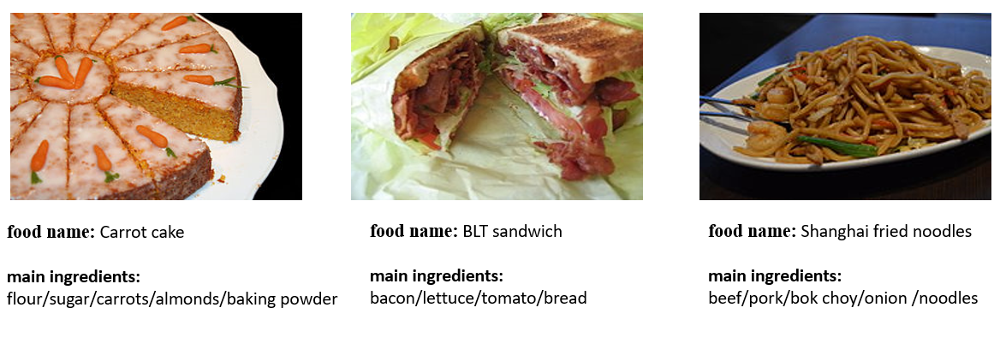

# <p align="center"> Ingredient-Guided Cascaded Multi-Attention Network for Food Recognition</p>

## Data collection
ISIA Food-200 consists of `197,323` food items.Each item includes the food name,food images,main ingredients.There are totally `200` kinds of food dishes and `398` ingredients.



## The dataset can also be downloaded from the following links:
[[image.rar]](https://www.google.com/?hl=zh_tw)
[[metadata.rar]](https://www.google.com/?hl=zh_tw)
[[readme.txt]](https://www.google.com/?hl=zh_tw)

## The dataset can also be downloaded from the following link:
https://pan.baidu.com/s/1YWqvl1bDW0l1xpjHoxEkCg

## Code Implementation
This is a PyTorch implementation of the ACMMM2019 paper "Ingredient-Guided Cascaded Multi-Attention Network for Food Recognition" (Weiqing Min, Linhu Liu, Zhengdong Luo, Shuqiang Jiang).

## Requirements
- python 2.7
- pytorch 0.4+

## Datasets
1.Download the ETH Food-101 or WikiFood-200(http://) datasets, you may obtain images which contain ingredient and category list. You can also try other food datasets. 
2.The category list is : 
    name_of_image.jpg label_num\n

    e.g for ETH Food-101:

    apple_pie/1057749.jpg 0
    apple_pie/1057810.jpg 0
    baby_back_ribs/1148389.jpg 1
    baby_back_ribs/1153312.jpg 1
3.The ingredient list is :
	name_of_image.jpg ingredient_label1 ingredient_label2 ...\n

	e.g for ETH Food-101:

	apple_pie/1005649.jpg 0 0 0 0 0 0 0 0 0 0 0 0 0 0 0 0 0 0 0 0 0 0 0 0 0 0 0 0 1 0 0 0 0 0 0 0 0 0 0 0 0 0 0 0 0 0 0 0 0 0 0 1 0 0 0 0 0 0 0 0 0 0 0 0 0 0 0 0 0 0 0 0 0 0 0 0 0 0 0 0 1 0 0 0 0 0 0 0 1 0 0 0 0 0 0 0 0 0 0 0 0 0 0 0 0 0 0 0 0 0 0 0 1 0 0 0 0 0 0 0 0 0 0 0 0 0 0 0 0 0 0 0 0 0 0 0 0 0 0 0 0 0 0 0 0 0 0 0 0 0 0 0 0 0 0 0 0 0 0 0 0 0 0 0 0 0 0 0 0 0 0 0 0 0
	beef_carpaccio/608583.jpg 0 0 0 0 0 0 0 0 0 0 0 0 0 0 0 0 0 0 0 0 0 0 0 0 0 0 0 0 0 0 0 0 0 0 0 0 0 0 0 0 0 0 0 0 0 0 0 0 0 0 0 0 0 0 0 0 0 0 0 0 0 0 0 0 0 0 0 0 0 0 0 0 1 0 0 0 0 0 0 0 0 0 0 0 0 0 0 0 0 0 0 0 0 0 0 0 0 0 0 0 1 0 0 0 0 0 0 0 0 0 0 0 0 0 0 0 0 0 0 0 0 0 1 0 0 0 0 0 0 0 0 0 0 0 0 0 0 0 1 0 0 0 0 0 0 0 0 0 0 0 0 0 0 0 0 0 0 0 0 0 0 0 0 0 0 0 0 0 0 0 0 0 0 0

## Train the model
If you want to train the model, just run 'python train_model.py'. You may need to change the configurations in train_model.py. The parameter 'DIR_TRAIN_IMAGES_INGREDIENT' is the ingredient list of train and 'DIR_TEST_IMAGES_INGREDIENT' is the ingredient list of test. 'DIR_TRAIN_IMAGES' is the category list of train and 'DIR_TEST_IMAGES' is the category list of test.  'vgg_multilabel_finetune' is the vgg pretrained model on food dataset,such as WikiFood-200. 'IMAGE_PATH' is the path of the image folder. 'NUM_INGREDIENT' is the ingredient number of food dataset. What's more, in 'IGCMAN_module.py', you may change the parameter 'food101_multilable_class'(the ingredient number of food dataset) and 'food101_category'(the category number of food dataset).

## Reference
If you are interested in our work and want to cite it, please acknowledge the following paper:


```
@InProceedings{Min-IG-CMAN-MM2019,
 author = {Min, Weiqing and Liu, Linhu and Luo, Zhengdong and Jiang, Shuqiang},
 title = {Ingredient-Guided Cascaded Multi-Attention Network for Food Recognition},
 booktitle = {Proceedings of the 27th ACM International Conference on Multimedia},
 year = {2019},
 pages = {1331--1339},
 numpages = {9},
} 
```
