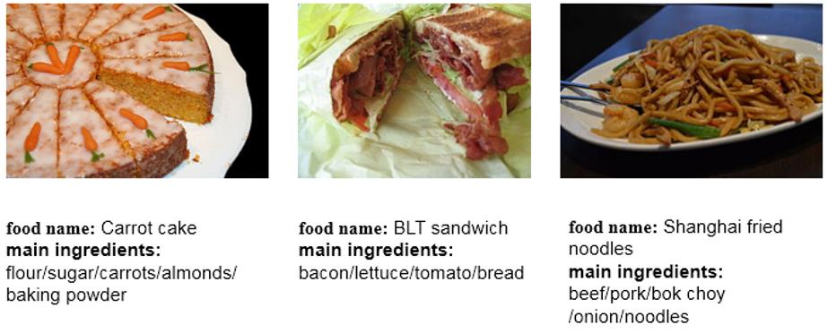

# 
 Ingredient-Guided Cascaded Multi-Attention Network for Food Recognition

 

## Data collection
ISIA-Food200 consists of `197,323` food items.Each item includes the food name,food images,main ingredients.There are totally `200` kinds of food dishes.

## Data ingredients

## The dataset can also be downloaded from the following links:
[[image.rar]](https://www.google.com/?hl=zh_tw)
[[metadata.rar]](https://www.google.com/?hl=zh_tw)
[[readme.txt]](https://www.google.com/?hl=zh_tw)

## The dataset can also be downloaded from the following link:
https://pan.baidu.com/s/1YWqvl1bDW0l1xpjHoxEkCg
